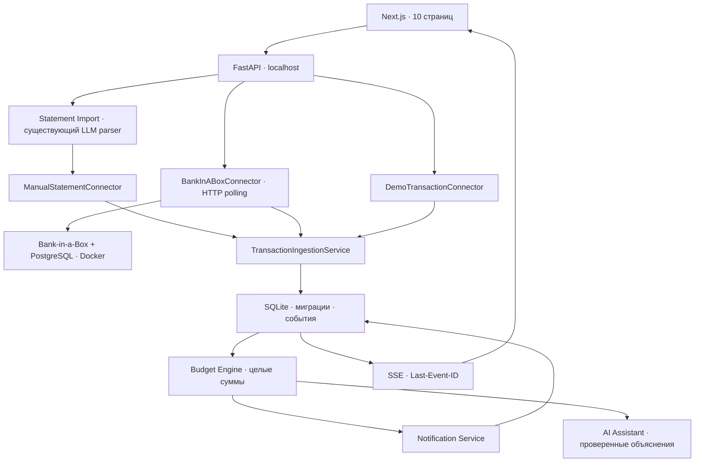

# Стипендия — финансовый помощник студента

Работающий локальный MVP: импорт выписки → операции → точный бюджет;
Bank-in-a-Box → HTTP polling → операции → бюджет/уведомления → SSE → интерфейс.
Покупки создаются отдельным явно обозначенным симулятором. Реальных счетов,
денежных переводов и оплаты подписки нет. T-API не используется.

## Запуск

Нужны Python 3.11+ (проверено на 3.14), Node.js 20.9+, Docker и Compose v2.

```bash
python3 -m venv .venv
.venv/bin/pip install -r requirements.txt
cp .env.example .env  # только при первом запуске; не перезаписывайте существующий .env
.venv/bin/python scripts/setup_bank_env.py
cd frontend
npm ci
cd ..
docker compose up -d --build
.venv/bin/python -m scripts.migrate
.venv/bin/python scripts/dev.py
```

Интерфейс: http://127.0.0.1:3000 • API приложения: http://127.0.0.1:8000/docs
• учебный банк: http://127.0.0.1:8080 • схема банка: http://127.0.0.1:8080/openapi.json.
Bank-in-a-Box может запускаться несколько минут при первой загрузке образов.
`docker compose logs --tail=30 bank` — проверить запуск.
`docker compose stop` останавливает банк с сохранением данных.
`Ctrl+C` останавливает frontend/backend.

В этой рабочей среде Compose отсутствовал, для запуска использован
`/tmp/stipendia-docker-compose` вместо `docker compose`.
Текущая проверенная база приложения размещена в `data/hackathon`; повторить запуск:

```bash
APP_DATA_DIR="$PWD/data/hackathon" .venv/bin/python scripts/dev.py
```

По умолчанию приложение использует `data/finance.db`. APP_DATA_DIR задайте **до**
старта процесса. Миграции выполняются автоматически при запуске, повторный запуск
безопасен; старые операции сохраняются. Запускайте один worker (локальный MVP).

## Что доступно

* 10 страниц на русском, адаптивная вёрстка, светлая/тёмная тема.
* Free: CSV локально, PDF через сохранённые `main.py` и `llm_pipeline.py`,
  очистка, проверка текста, предпросмотр, исправление/исключение строк, подтверждение.
* Pro · демо: серверный флаг на странице тарифов, банк и polling каждые 15 секунд,
  без оформления подписки. При отключении останавливаются polling и генератор;
  импортированная история остаётся.
* Операции с устойчивыми внешними ID, MCC, статусами, возвратами, несколькими
  счетами/валютами. Decimal при чтении суммы, далее целые минимальные единицы.
* Бюджет: известный остаток − обязательные платежи − резерв − холды;
  ежедневный бюджет = доступное / дни до поступления. Дефицит показан отдельно.
  RUB-прогноз, остальные валюты без неявной конвертации. Без остатка прогноз неизвестен.
* Уведомления о дневном/месячном лимите, крупной покупке, нехватке и ошибке банка;
  дедупликация и отдельные настройки типов. SSE с переподключением и refetch.
* Демо-лаборатория: ручная покупка/доход/перевод, интервал, сценарий, возврат,
  проведение/отмена холда, восстановление seed=42.
* AI использует прежний OpenAI-совместимый клиент, выбирает релевантные объяснения;
  значения в ответе всегда рендерятся сервером из расчётов. При сбое — локальный ответ.

## Источники аналитики

«Демо-выписки · Free» — импортированные синтетические документы;
«Учебный банк + симулятор» — независимые учебные счета;
«Мои выписки» — обезличенные документы с выключенным demo-признаком;
«Bank-in-a-Box отдельно» — только банк. Обратносовместимый API scope=combined
может включить пересекающуюся историю и не показан в интерфейсе.
По содержимому нельзя надёжно дедуплицировать независимые источники без банковского ID.
Внутри источника повторные импорты идемпотентны. Одинаковые строки внутри одной
выписки сохраняются как отдельные операции с порядковым суффиксом.

## LLM

`API_KEY`, `LLM_BASE_URL`, `LLM_MODEL` — только backend `.env`.
CSV, банк, симулятор, бюджет и локальные объяснения работают без ключа.
Для PDF: загрузить синтетический/обезличенный документ, проверить очищенный текст,
подтвердить обработку LLM, проверить результат, подтвердить импорт.
Модель может ошибиться при извлечении: её результат не импортируется без проверки.
Существующие CLI и кэширование парсера сохранены.

## Архитектура



Основные файлы: `backend/bank_in_a_box.py`, `backend/assistant.py`, `backend/app.py`,
`backend/db.py`, `backend/services.py`, `backend/simulator.py`, `backend/schemas.py`,
`frontend/components/finance-app.tsx`, `frontend/lib/realtime.mjs`, `compose.yaml`,
`infra/bank/launch.py`. Аудит — [docs/AUDIT.md](docs/AUDIT.md), банковский контракт и
ограничения — [docs/BANK_IN_A_BOX.md](docs/BANK_IN_A_BOX.md), выступление —
[README_DEMO.md](README_DEMO.md).

## Проверки

```bash
.venv/bin/python -m pytest -q tests test_llm_pipeline.py test_personal_data.py
cd frontend
npm test
npm run typecheck
npm run build
cd ..
# При запущенных приложении и банке; изменяет только демосценарий:
.venv/bin/python -m scripts.smoke
# Также проверяет синтетическую PDF через настроенную LLM:
.venv/bin/python -m scripts.smoke --llm
```

`tests/test_bank.py` проверяет контракт через MockTransport, ошибки, повторный sync,
статусы, MCC, allowlist счетов, пагинацию, тариф, сценарий, PDF и недоступность LLM.
`tests/test_backend.py` — импорт, возвраты, трансферы, бюджет, настройки уведомлений.
`frontend/tests/realtime.test.mjs` — refetch при SSE, уведомления, переподключение,
очистка подписки. `scripts/smoke.py` использует реальный локальный банк и настоящий
SSE, проверяет сохранение банковского баланса после покупки в симуляторе.

## Границы MVP

Приложение намеренно локальное, с одним синтетическим пользователем `local-demo`;
публичной регистрации и многопользовательской авторизации нет. Запросы данных
ограничены владельцем, произвольный user_id не принимается. Нельзя публиковать
этот процесс или учебный банк наружу. Перед production нужны полноценная
авторизация/сессии, изоляция tenant, шифрование секретов, rate limits и фоновые workers.
Банковские пароли/SMS/CVV/номера реальных карт не вводятся и не собираются.

Bank-in-a-Box не имеет подходящего метода покупки и webhook истории;
автоматизация — периодический опрос, а покупка — отдельная симуляция.
Синхронизация не является атомарным snapshot банковской БД; точность состояния
ограничена временем последнего успешного опроса. Подробности и дефекты upstream
зафиксированы в банковском аудите. Федерация HackAPI, реальные OAuth-подключения,
реальная оплата и денежные переводы не входят в MVP.
